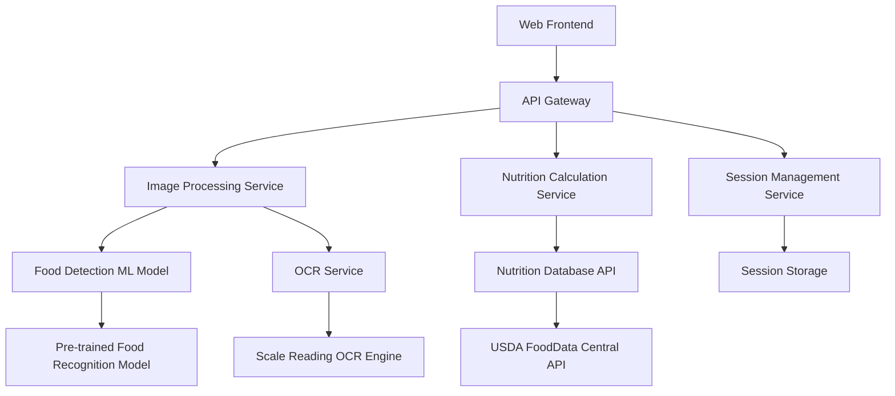

# Design Document

## Overview

The Food Nutrition Detector is a web application designed with mobile-first principles that combines computer vision, optical character recognition (OCR), and nutrition data APIs to automatically analyze food images and provide detailed nutrition information. The system processes images containing food on digital scales, identifies the food items, reads the scale weight, and calculates nutrition values based on the actual measured portions.

The application supports sequential ingredient addition, allowing users to build complex meals by adding ingredients one at a time while maintaining accurate weight differentials and cumulative nutrition tracking. The architecture is designed to support future migration to a React Native mobile app while using only free and commercially-friendly APIs and ML models.

## Architecture

### High-Level Architecture



### Technology Stack

- **Frontend**: React.js with TypeScript (web), React Native (future mobile app)
- **Backend**: Node.js with Express.js
- **Image Processing**: Python microservice using OpenCV and TensorFlow/PyTorch
- **Database**: Redis for session storage, PostgreSQL for application data
- **ML Models** (Free & Commercial-Use Friendly): 
  - Food detection: Open-source YOLO models or Food-101 dataset trained models
  - OCR: Tesseract.js (completely free and open-source)
- **Nutrition API**: USDA FoodData Central API (free government API)
- **Mobile Considerations**: 
  - Responsive web design for immediate mobile browser support
  - React Native architecture for future native mobile app
  - Offline-capable nutrition database for mobile app version

## Components and Interfaces

### Frontend Components

#### ImageUploadComponent
- **Purpose**: Handle image capture/upload and display
- **Props**: `onImageUpload: (file: File) => void`, `isProcessing: boolean`
- **Features**: Camera integration, drag-and-drop upload, image preview

#### FoodConfirmationComponent
- **Purpose**: Display detected food and allow user corrections
- **Props**: `detectedFood: FoodItem[]`, `onFoodConfirm: (food: FoodItem) => void`
- **Features**: Alternative suggestions, manual search, confidence scores

#### WeightConfirmationComponent
- **Purpose**: Show detected weight and allow manual correction
- **Props**: `detectedWeight: number`, `unit: string`, `onWeightConfirm: (weight: number) => void`
- **Features**: Unit conversion, manual input field

#### NutritionDisplayComponent
- **Purpose**: Show nutrition information and meal tracking
- **Props**: `nutritionData: NutritionInfo`, `mealComponents: MealComponent[]`
- **Features**: Individual and cumulative nutrition, meal finalization

#### MealTrackerComponent
- **Purpose**: Manage sequential ingredient additions
- **Props**: `sessionId: string`, `currentMeal: MealSession`
- **Features**: Ingredient history, weight differentials, session management

### Backend Services

#### ImageProcessingService
```typescript
interface ImageProcessingService {
  detectFood(imageBuffer: Buffer): Promise<FoodDetectionResult[]>
  readScaleWeight(imageBuffer: Buffer): Promise<WeightReading>
  validateImage(imageBuffer: Buffer): Promise<ImageValidation>
}
```

#### NutritionService
```typescript
interface NutritionService {
  getNutritionData(foodId: string, weight: number): Promise<NutritionInfo>
  searchFoodDatabase(query: string): Promise<FoodItem[]>
  calculateMealNutrition(ingredients: MealComponent[]): Promise<MealNutrition>
}
```

#### SessionService
```typescript
interface SessionService {
  createSession(): Promise<string>
  addIngredient(sessionId: string, ingredient: MealComponent): Promise<MealSession>
  getSession(sessionId: string): Promise<MealSession>
  finalizeMeal(sessionId: string): Promise<MealNutrition>
}
```

## Data Models

### Core Data Types

```typescript
interface FoodItem {
  id: string
  name: string
  confidence: number
  alternativeNames: string[]
  category: string
}

interface WeightReading {
  value: number
  unit: 'g' | 'oz' | 'lb'
  confidence: number
  rawText: string
}

interface NutritionInfo {
  calories: number
  protein: number
  carbohydrates: number
  fat: number
  fiber: number
  sodium: number
  sugar: number
  saturatedFat: number
  cholesterol: number
  potassium: number
}

interface MealComponent {
  food: FoodItem
  weight: number
  nutrition: NutritionInfo
  addedAt: Date
}

interface MealSession {
  id: string
  components: MealComponent[]
  totalWeight: number
  previousWeight: number
  createdAt: Date
  lastUpdated: Date
}

interface MealNutrition {
  totalNutrition: NutritionInfo
  components: MealComponent[]
  totalWeight: number
}
```

### API Response Types

```typescript
interface ProcessImageResponse {
  sessionId: string
  detectedFood: FoodDetectionResult[]
  detectedWeight: WeightReading
  weightDifference?: number
  previousWeight?: number
}

interface FoodDetectionResult {
  food: FoodItem
  alternatives: FoodItem[]
  boundingBox: BoundingBox
}

interface ConfirmSelectionRequest {
  sessionId: string
  selectedFood: FoodItem
  confirmedWeight: number
}
```

## Error Handling

### Image Processing Errors
- **Invalid Image Format**: Return 400 with supported formats
- **No Food Detected**: Prompt user to retake photo or manual entry
- **Scale Unreadable**: Allow manual weight input with clear messaging
- **Multiple Scales Detected**: Ask user to specify which scale to read

### API Integration Errors
- **Nutrition API Unavailable**: Use cached data or show limited nutrition info
- **ML Model Timeout**: Fallback to manual food selection
- **Rate Limiting**: Implement exponential backoff and user notification

### Session Management Errors
- **Session Expired**: Create new session and inform user
- **Invalid Weight Difference**: Alert user and allow correction
- **Concurrent Modifications**: Use optimistic locking with conflict resolution

### Error Response Format
```typescript
interface ErrorResponse {
  error: string
  code: string
  message: string
  details?: any
  suggestions?: string[]
}
```

## Testing Strategy

### Unit Testing
- **Frontend Components**: Jest + React Testing Library
  - Image upload functionality
  - User confirmation workflows
  - Nutrition display accuracy
- **Backend Services**: Jest + Supertest
  - API endpoint validation
  - Service layer logic
  - Error handling scenarios

### Integration Testing
- **ML Model Integration**: Test food detection accuracy with sample images
- **OCR Integration**: Validate scale reading with various scale types
- **Nutrition API Integration**: Verify data accuracy and error handling
- **Session Management**: Test concurrent user scenarios

### End-to-End Testing
- **Complete User Workflows**: Cypress tests for full user journeys
  - Single food detection and nutrition calculation
  - Multi-ingredient meal building
  - Error correction workflows
- **Cross-browser Testing**: Ensure compatibility across major browsers
- **Mobile Responsiveness**: Test touch interactions and camera functionality

### Performance Testing
- **Image Processing Speed**: Ensure sub-30-second processing times
- **API Response Times**: Target sub-3-second initial load
- **Concurrent User Load**: Test system under multiple simultaneous users
- **Memory Usage**: Monitor for memory leaks in long sessions

### Test Data Strategy
- **Sample Food Images**: Curated dataset of various foods on different scales
- **Scale Reading Samples**: Images with different scale types and lighting conditions
- **Nutrition Data Validation**: Cross-reference with known nutrition values
- **Edge Cases**: Blurry images, multiple foods, unusual angles
## 
Free & Open Source Model Specifications

### Food Detection Models
- **Primary Option**: YOLOv8 trained on Food-101 dataset
  - License: GPL-3.0 (free for commercial use)
  - Accuracy: ~85% on common foods
  - Size: ~50MB model file
- **Alternative**: MobileNetV2 with custom food classification head
  - License: Apache 2.0
  - Optimized for mobile deployment
  - Size: ~14MB model file

### OCR Implementation
- **Tesseract.js**: Complete OCR solution
  - License: Apache 2.0
  - No API costs or rate limits
  - Supports multiple languages and number recognition
  - Client-side processing capability for mobile app

### Nutrition Database
- **USDA FoodData Central API**
  - Completely free government API
  - No rate limits for reasonable use
  - Comprehensive nutrition data for 300,000+ foods
  - Regular updates and maintenance

## Mobile App Migration Strategy

### Phase 1: Mobile-Responsive Web App
- Progressive Web App (PWA) capabilities
- Camera API integration for mobile browsers
- Touch-optimized UI components
- Offline nutrition data caching

### Phase 2: React Native Migration
- Shared business logic between web and mobile
- Native camera integration
- Local ML model execution
- Offline-first architecture with sync capabilities

### Deployment Considerations
- **Web Hosting**: Vercel or Netlify (free tiers available)
- **Backend Hosting**: Railway or Render (free tiers with limitations)
- **Database**: PostgreSQL on Railway/Render, Redis Cloud free tier
- **ML Model Hosting**: Self-hosted on backend or edge deployment